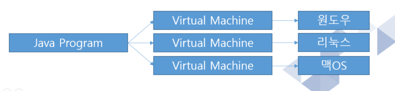
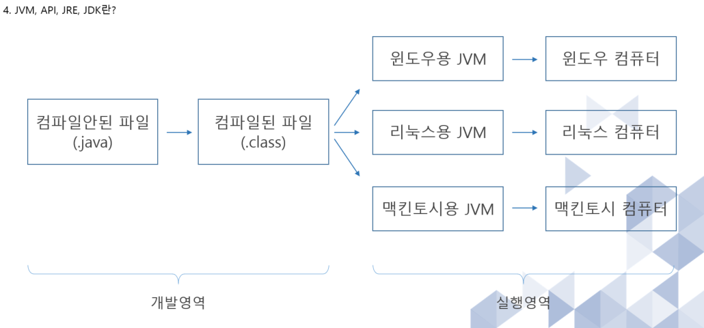
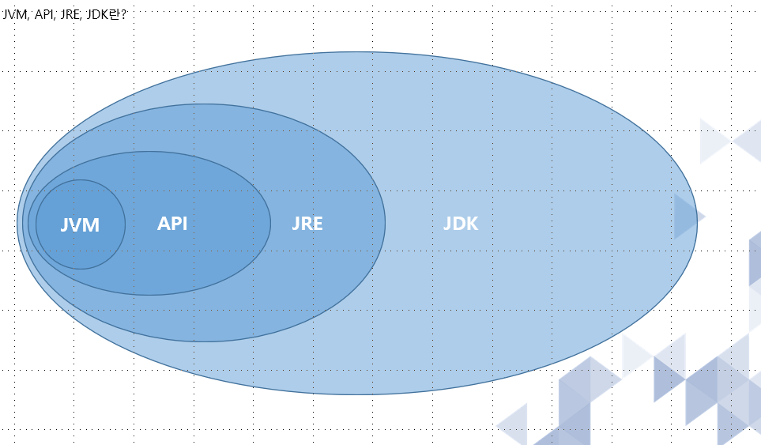

# 1.JAVA 프로그래밍이란 -1 
___
### 1.처음 프로그램을 접하는 초보 개발자
    1. 개발자는 계획적인 사고방식을 가져야 한다
    (일정, 품질관리, 위험에 대비한 전체적인 계획이 있어야 한다.)
    
    2. 팀원들은 무조건 사이가 좋아야 한다.
    
    3. 타 조직과의 업무에서 상대방을 존중하는 자세를 가져야 한다.
    
    4. 프로젝트 일정을 개인의 입장에서 생각하지 말고 
    같이 일하는 사람들의 입장에서 생각해야 한다.
    
    5. 타인의 지적을 긍정적으로 받아들일 수 있어야 한다.
    
    6. 100% 완벽한 프로그램은 없다. 꾸준히 리펙토링을 하고, 
    종료된 프로젝트의 경우 개인적으로 최적화된 구조에 대해서 연구하자
    
    7. 회사에서 시키는 것에 무조건 OK 하는 자세는 좋지 못하다
    
    8. 개발 중 클라이언트의 요구 사항이 늘어날 경우 
    팀 리터와 의논하고 팀 리더의 도움을 받자.
### 2.JAVA 언어의 탄생과 특징
1. JAVA 언어의 탄생
    1990년대 초에 탄생
    기존의 C/C++ 에 비해 속도가 많이 느려 사람들로부터 외면 
    2000년대 들어오면서 인터넷의 등장으로 JAVA를 외면했던 사람들로부터 관심을 얻기 시작 

___  
* JAVA의 대표적인 3가지 플랫폼
    * JAVA SE(Stand Edition)   JAVA Application 개발  >  일반적인 어플리케이션 개발
    * JAVA ME(Mobile Edition)   휴대 가능한 소형 디바이스에 사용을 목적으로 개발  > 현재의 스마트폰 등작으로 쇠퇴
    * JAVA EE(Enterprise Edition)   기업 솔루션 개발  > 가장 핵심

___
2. JAVA 언어의 특징
    * Virtual Machine – 운영체제(윈도우, 리눅스, 맥OS)의 영향을 받지 않는다.
    * Garbage Collection – 개발자는 메모리 관리를 하지 않는다.
    * Object Oriented Program(OOP) – 객체지향 언어로 개발과 유지보수를 효율적으로 진행 할 수 있다.
	

### 3.JAVA 프로그래밍 환경 설정과 실행 방법
#### JAVA 개발 환경설정
    * JDK(Java Development Kit) : Java개발 키트
    * IDE(Integrated Development Environment) : 통합 개발툴(편집기)
    
    * JDK 설치
 [java 공식사이트](http://java.sun.com)
    
    