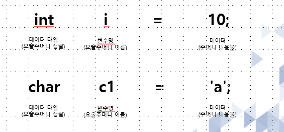

# 2.JAVA 프로그래밍이란 -2
___
## 1. JAVA 프로그램 환경 설정과 실행 방법
bin/javac.exe : .java 파일을 JVM이 받아들일 수 있는 .class 파일로 변환 시켜주는 프로그램.                     매번 해당 경로에 들어가서 실행하기가 번거로우므로, 환경 변수 설정을 통해 어디서나 실행 가능하게 함. 

## 2. 변수란?
* 변수는 데이터를 저장하는 메모리 영역 
 수시로 값이 변경 될 수 있으며 하나의 값만 저장 가능

## 3. 기본 자료형과 객체 자료형의 이해
#### 기본 자료형(Primitive)
Java언어에 이미 존재하고 있는 데이터 타입. 주로 간단한 데이터들 이다. (예. Int, double, Boolean, char 등등…)

#### 객체 자료형(Object)
여러가지 데이타들이 모여 있는 복잡한 데이터로 기본 자료형에 비해 크기가 크다. (예. String, System, ArrayList 등등…)

* 기본 데이터 타입  

    * boolean, byte, char, short, int, long, float, double  

* 접근 지정자  

    * private, protected, public  

* 클래스와 관련 

    * class, abstract, interface, extends, implements, enum  

* 객체 관련 

    * new, instanceof, this, super, null  

* 메서드 관련 

    * void, return  

* 제어문 관련 

    * if, else, switch, case, default, for, do, while, break, continue  

* 논리값 

    * true, false  

* 예외 처리 관련 
    * try, catch, finally, throw, throws 

* 기타  

    * transient(직렬화하지 않음-선택적 직렬화), volatile(원자성보장),  

    * package(클래스 상단 패키지 선언), import(package import),  

    * synchronized(작업단위 동기화),  

    * native(타 언어로 구현된 기능 사용),  

    * final(변수를 상수화),  

    * static(직접 메모리 적재),  

    * strictfp(부동소수(floating point) 계산의 특정한(restrict) 사항들을 제어),  

    * assert(디버깅코드) 

## 4. 형변환의 이해(묵시적, 명시적)
* 기본 자료형
	JAVA 언어에 이미 존재하고 있는 데이터 타입,
	주로 간단한 데이터
    
* 객체(참조)자료형
	여러 가지 데이터들이 모여 있는 복잡한 데이터로 기본 자료형에 비해 크고 
	주소값을 가리키고 있다
	String, System, ArrayList